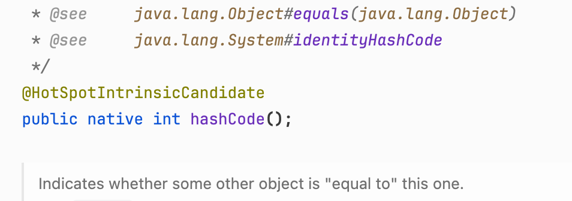
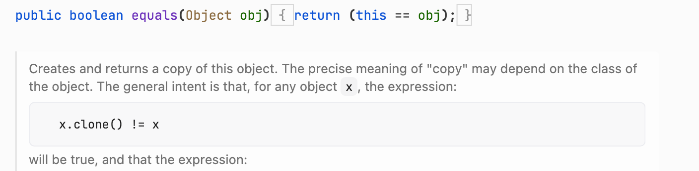
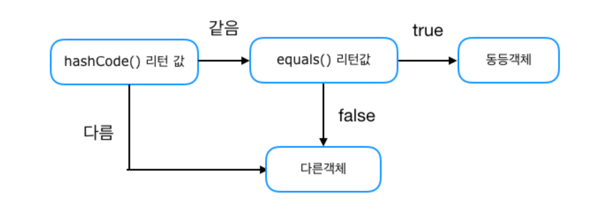
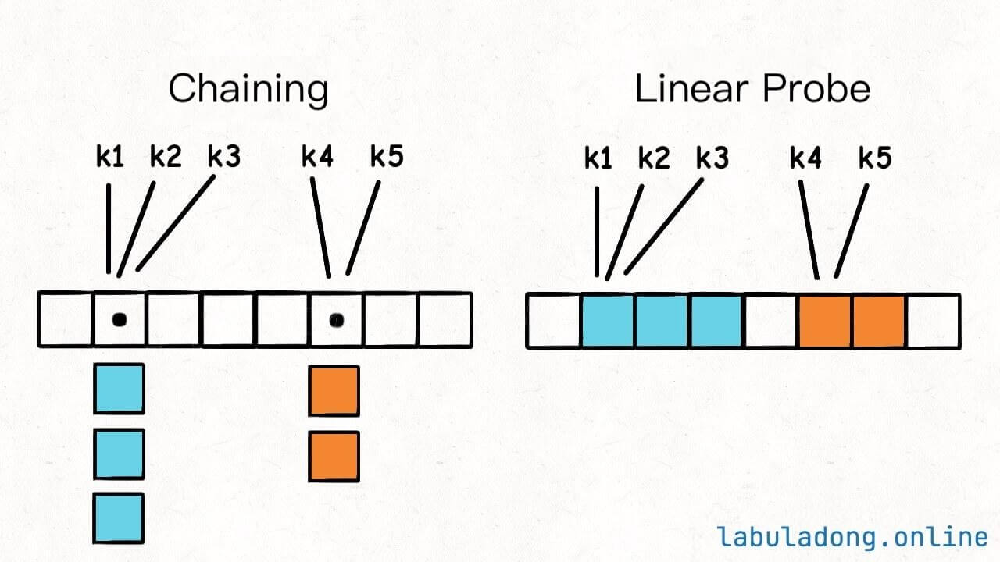
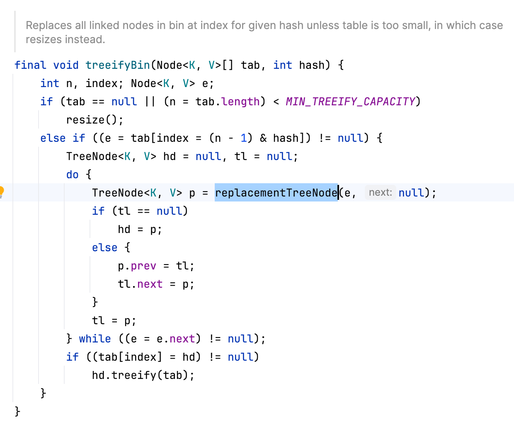

# HashMap과 hashCode, equals

## **Object 기본 제공 메소드**

### **1. hashCode()**

<div align="left"><figure><figcaption></figcaption></figure></div>

* C++로 구현(Park-Miller Random Number Generator 사용 전략)
* **메모리 주소** 기반 전략
* **int 값**

### **2. equals()**

<div align="left"><figure><figcaption></figcaption></figure></div>

* this == obj : **주소값 비교(Identity)**

## **Identity vs Equality**

* Identity 동일성
  * 메모리 주소가 같나요? (참조가 동일한 객체를 가리키는지)
  * \== 연산자로 비교
* Equality 동등성
  * 값이 같나요?
  * equals() **메소드를 Override하여 동등성을 구현**

### **String이 Equality를 구현한 방법**

*   대표적으로 String은 어떻게 Object의 메소드를 Overriding 해서 Equality를 구현했는지 확인하자

    ```java
    // StringLatin1.java 에서 발췌
    public static int hashCode(byte[] value) {
        int h = 0;
        for (byte v : value) {
            h = 31 * h + (v & 0xff);
        }
        return h;
    }

    public static boolean equals(byte[] value, byte[] other) {
        if (value.length == other.length) {
            for (int i = 0; i < value.length; i++) {
                if (value[i] != other[i]) {
                    return false;
                }
            }
            return true;
        }
        return false;
    }
    ```

    ⇒ 주소값이 아니라, byte **value를 사용**해서 hashCode()와 equals()를 구현

### **Object Equality 를 위한 equals(), hashCode() 구현 전략**

*   equals() : 성능을 위해 필드 비교 전에 **Short Circuit** 으로 빠르게 걸러주기

    1. 참조 주소가 같나?(==) ⇒ true
    2. null인가? ⇒ false
    3. 타입 불일치 하는가?(instanceof) ⇒ false
    4. 필드 비교

    ```java
    @Override
    public boolean equals(Object obj) {
        if (this == obj) return true;
        if (obj == null || getClass() != obj.getClass()) return false;
        Person person = (Person) obj;
        return age == person.age && Objects.equals(name, person.name);
    }
    ```
* hashCode()
  * Objects.hash()를 사용하면 필드 값을 넣어 간단하게 만들 수 있음!(성능은 최적화 X)

## **equals를 재정의하려거든 hashCode도 재정의하라?**

* `Effective Java` 의 Item 11
* Hash Collection에서 hashCode를 key로 이용하기 때문에 equals 로직만 바꾸면 의도한대로 동작하지 않을 수 있다


```
- equals 비교에 사용되는 정보가 변경되지 않았다면, hashCode는 항상 같은 값을 반환한다
- equals가 두 객체를 같다고 판단했다면, 두 객체의 hashCode는 같은 값을 반환해야한다
- equals가 두 객체를 다르다고 판단했어도, hashCode가 다른 값을 반환할 필요는 없다
    - 다만 다른 객체에 대해서는 다른 값을 반환해야 해시테이블 성능이 좋아진다 
```


## **HashMap과 hashCode() 작동 원리**

* **hashCode()** 메서드를 사용해 **Key의 해시 코드**를 생성
* 해시 코드를 기반으로 **배열 인덱스(버킷 위치)** 계산 → bucket에 Node 저장
  * `int index = hashCode % (배열 크기);`
  * **인덱스로 접근 ⇒ O(1)**
* **동일한 해시 코드**의 경우 충돌 처리(**Linked List, Red-Black Tree**)
  * hashCode가 같아도 equals로 key의 Equality 확인
  *   `hashCode()가 같으면서` && `equals()가 true`인 경우(**Short Circuit**)

      <div align="left"><figure><figcaption><p><a href="https://i.imgur.com/dShPCEh.png">https://i.imgur.com/dShPCEh.png</a></p></figcaption></figure></div>


### Hash Bucket Resizing

* Default Bucket Size: 16
* Default Threshold: 75% (Load Factor)
* Threshold 이를 때 2배로 확장
  * 최대 2^30
  * 사이즈 늘릴 때 버킷 전체 다시 해시 ⇒ 성능 이슈

⇒ 충돌 가능성 감소

그러나 hashCode의 충돌을 “막을 수는” 없기 때문에, 저장 방식 전략으로 충돌을 해결한다

### Hash Collision Resolution

해시 충돌 :다른 키에 대해 index 겹칠 때 발생

<figure><figcaption><p><a href="https://labuladong.online/algo/en/data-structure-basic/linear-probing-key-point/">labuladong.online</a></p></figcaption></figure>

* Open Addressing
  * 충돌이 발생하면 다른 빈 공간을 찾아 저장하는 방식
  * Linear probing : 충돌 발생 시 다음 칸(빈자리)로 밀어 넣음
  * HashTable에서 사용
* **Separate Chaining**
  * 각 버킷(배열의 인덱스)마다 **연결 리스트** 또는 트리 등으로 돌이 발생한 요소들을 **연결**
  * HashMap이 사용하는 방식

### Java 8, LinkedList + Red-Black Tree 전략

일정 Threshold(Default 8)까지는 LinkedList로 충돌 데이터를 연결하다가, 넘어가면 Red-Black Tree로 전환

#### 1. LinkedList : O(n)

*   HashMap의 Node → next Node

    ```java
    static class Node<K,V> implements Map.Entry<K,V> {
        final int hash;
        final K key;
        V value;
        Node<K,V> next; // 충돌이 일어나면 next Field로 참조 주소 저장해서 연결(LinkedList)
    ```
* 근데, 만약에 충돌이 많이 발생해서 이렇게 연결해서 저장하는 게 n만큼 길어지면, 저장할 때마다 해당 key의 LinkedList 길이만큼인 O(n) 복잡도가 발생한다(제일 끝에 저장해야하니까)

#### 2. Red-Black Tree : O(log n)

*   LinkedList가 설정한 Threshold 만큼 길어지면 → **Red-Black Tree로 전환**


    <div align="left"><figure><figcaption></figcaption></figure></div>

    * treeifyBin() : Node → TreeNode
      * 상속 관계 : Map.Entry → **HashMap.Node\<K, V>** → LinkedHashMap.Entry\<K, V> → **TreeNode\<K, V>**
        *   replacementTreeNode()에서 하위 Node도 모두 TreeNode로 전환 + treeify로 연결\


            <div align="left"><figure><figcaption></figcaption></figure></div>

