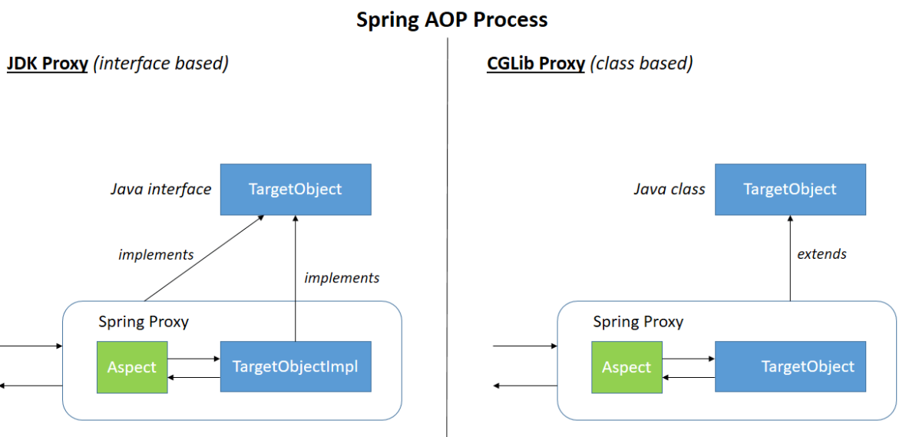
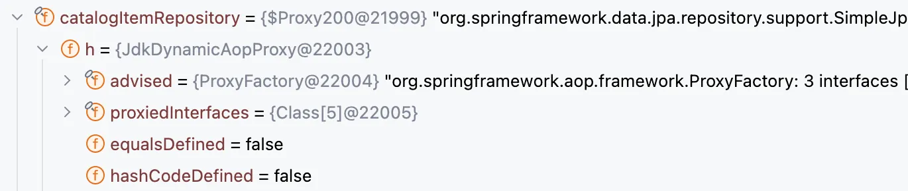
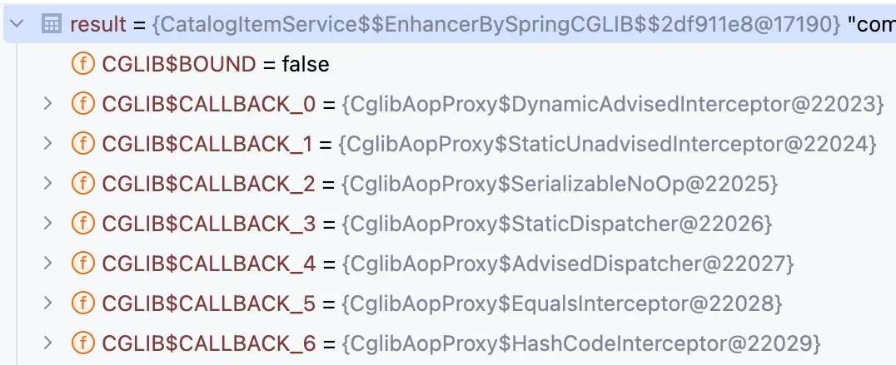

# Java가 Proxy를 생성하는 법

## Spring AOP Proxy

* Spring AOP는 Runtime에 Proxy Instance가 동적으로 변경되는 다이나믹 프록시 기법으로 구현

<figure><figcaption><p><a href="https://medium.com/@spac.valentin">https://medium.com/@spac.valentin</a></p></figcaption></figure>

##

## 1. JDK Dynamic Proxy

Java Reflection 패키지의 Proxy 클래스를 통해 생성된 Proxy 객체

<div align="left"><figure><figcaption></figcaption></figure></div>

* Interface 기반
* Reflection을 이용한 Runtime 생성
*   Client → Proxy → InvocationHandler(invoke) → Target

    ```java
    Object proxy 
         = Proxy.newProxyInstance(ClassLoader, Class<?>[], InvocationHandler);
    ```

    * InvocationHandler : Target에 대한 위임 코드 작성
    * invoke : Target에 대한 정보 검증을 위해 Reflection으로 확인 ⇒ 성능 이슈

### Reflection

: Runtime 에 클래스, 메서드, 필드 등의 메타 데이터에 접근하고 조작할 수 있게 해주는 자바 기능

* Method Area에 있는 바이트 코드 메타 데이터 접근

#### Spring이 Bean 을 등록하고, DI를 하는 방법

1.  Bean 등록

    ```java
    @Target({ElementType.METHOD, ElementType.ANNOTATION_TYPE}) // 주로 method
    @Retention(RetentionPolicy.RUNTIME) // Runtime까지 annotation 유지
    @Documented
    public @interface Bean {  // 빈 이름, 객체 수동 등록

    @Target({ElementType.TYPE}) // type : interface, class
    @Retention(RetentionPolicy.RUNTIME)
    @Documented
    @Indexed
    public @interface Component {  // Component Scan으로 자동 등록
    ```

    * 런타임까지 어노테이션을 유지하고, Reflection으로 어노테이션 조회
2. DI
   * Reflection으로 @Autowired 찾아서 주입

\<aside> 📌

@Retention - 어노테이션의 수명 주기 정의

* SOURCE : 컴파일 시에만 어노테이션이 유효, 바이트 코드(.class)에 포함 X
* CLASS : 바이트코드까지 어노테이션 유효, 런타임 포함 X
* RUNTIME : 런타임에도 어노테이션 유효, Reflection으로 어노테이션 정보 동적 조회 \</aside>

## 2. CGLib

Code Generator Library, 클래스의 바이트코드를 조작하여 Proxy 객체를 생성

<div align="left"><figure><figcaption></figcaption></figure></div>

* Class 기반 프록시 → Interface 필요 없음
* 상속으로 Target Class의 Sub Class 만들어 프록시 생성
  * final class 상속 불가 → CGLib 프록시 생성 불가
  * final method override 불가 → CGLib 프록시 적용 불가
* 바이트 코드 조작 → Runtime 생성
* **스프링3.2 이후 CGLib가 Spring-Core에 포함, Spring boot에서는 전부 CGLib를 사용**
  * 디폴트 생성자 필요, 생성자 중복 호출 개선

### @Configuration 을 @Bean 에 함께 써야하는 이유(CGLib)

* @Bean **with** @Configuration
  * Spring 컨테이너가 시작될 때 @Configuration이 붙은 클래스를 CGLIB 프록시로 감싼다
  * @Bean 호출 시 Proxy가 메소드 실행을 가로챔 ⇒ 싱글톤 보장
* @Bean **without** @Configuration
  * CGLib 프록시를 사용하지 않음 ⇒ @Bean 메서드 호출 시 싱글톤 보장이 안됨

## 만났던 Case들!

기본적으로 Interface가 있으면 Dynamic Proxy, 없으면 CGLib

* Spring Data의 Interface Repository ⇒ 인터페이스 있으니까 Dynamic Proxy
* 메소드 @Transactional ⇒ 구현 Method에 붙으면 CGLib
* @Bean ⇒ 구현 Method에 붙으면 CGLib
* Hibernate의 Lazy loading ⇒ Entity가 구체 클래스면 CGLib
