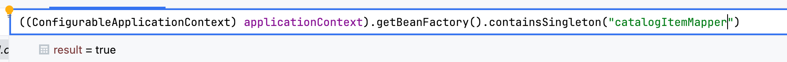
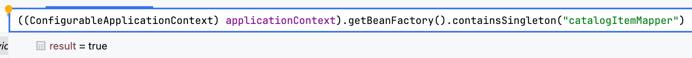

# @Lazy로 Bean Self-Injection 하기

## @Lazy : Bean 지연 초기화

@Lazy: Lazy initialization of beans in Spring, **Bean을 사용할 때까지 초기화를 지연시키는 방법**

* spring boot의 속성값 변경으로도 lazy 초기화 설정 가능, xml의 lazy-init으로도 가능

1. Bean Initialization 시점을 지연
   * @Configuration, @Component, @Bean 에 같이 붙여서 사용
   * 실제 호출(getBean) 혹은 DI를 당하는 순간 초기화
2. Bean Injection의 Initialization 시점을 지연
   * DI 시 parameter/field 에 붙여서 사용

### Eager vs Lazy Initialization

#### Eager Initialization

Spring Context가 시작될 때, 모든 빈을 즉시 생성하고 초기화 하는 방법

* 스프링은 Application Context가 시작될 때 모든 Singleton Bean 생성/init ⇒ default는 Eager
* 특징
  * 어플리케이션 시작이 느려질 수 있음 ⇒ 이후 빈 사용시 지연 X
  * 메모리 미리 사용해 사용량 높을 수 있음
  * 초기화 시점에 예외 발생 시 Application 시작 실패

#### Lazy Initialization

빈이 실제로 필요해질 때(DI, .getBean) 빈을 초기화

* BeanFactory의 default는 lazy 방식
* 특징
  * 어플리케이션 시작 속도가 빨라질 수 있음
  * 메모리 효율적으로 사용 가능
  * Runtime에 Bean 초기화 Exception 발생 가능
  * DI 시점에 Proxy로 Bean 주입


## 올바른 @Lazy 적용 방법 탐구

현재 예시의 관계는 `catalogItemService`(CurrentBean)에 `catalogItemMapper`(InjectedBean) 를 주입하는 것이고, 보고있는 객체는 `catalogItemService` 시점.

<pre data-title="📌 주의" data-overflow="wrap"><code>Debug로 Bean 초기화 여부를 확인하려고 했는데, applicatationContext.getBean("name") 을 해버리면, 그 시점에 초기화가 되어서 대신 containsSingleton()으로 초기화 여부를 확인해줬다

<strong>+ containsBean()은 초기화와 상관없이 Registration 여부를 확인해서 초기화 안 되도 true 반환
</strong></code></pre>

#### 1. Bean(Lazy X) & DI(Lazy X) : Default

*   `ApplicationContext`에서 InjectedBean 초기화 여부 확인 ⇒ **초기화 O**

    <figure><figcaption></figcaption></figure>
* `CurrentBean`의 this ⇒ InjectedBean **초기화 O**\
  .png>)

#### 2. Bean(Lazy O) & DI(Lazy O) : Bean 자체 초기화 지연

*   `ApplicationContext`에서 InjectedBean 초기화 여부 확인 ⇒ **초기화 X**

    <figure><figcaption></figcaption></figure>
* `CurrentBean`의 this ⇒ InjectedBean _초기화 X_\
  .png>)

#### 3. Bean(Lazy O) & DI(Lazy X) : Lazy 적용 X \*\*

**: DI 하면서 초기화 하기 때문에, Bean에 Lazy 적용한다고 초기화 지연되지 않음 ⇒ 양쪽에 해야 의도한대로 적용**

*   `ApplicationContext`에서 InjectedBean 초기화 여부 확인 ⇒ **초기화 O**

    <figure><figcaption></figcaption></figure>
* `CurrentBean`의 this ⇒ InjectedBean **초기화 O**\
  .png>)

#### 4. Bean(Lazy X) & DI(Lazy O) : DI만 초기화 지연

*   `ApplicationContext`에서 InjectedBean 초기화 여부 확인 ⇒ **초기화 O**

    <figure><figcaption></figcaption></figure>
*   `CurrentBean`의 this ⇒ InjectedBean **초기화 X**

    .png>)\


## @Lazy DI로 Self-Injection + @Lombok 생성자 주의점!

DI를 할 때 Constructor, Setter, Field 기반 방식 세가지 중에서는, Compile time에 순환 참조를 막아줄 수 있는 Constructor 방식을 썼다. 생성자를 간편하게 만들기 위해 Lombok의 RequiredArgsConstructor와 함께 쓰고 있었기 때문에 field에 @Lazy를 붙여서 적용해 줬지만 Lazy 적용에 실패했다

#### **1. Constructor 주입시 @Lazy 적용**

1.  **@Lombok Constructor + @Lazy => 적용 X**

    ```java
    @Service
    @RequiredArgsConstructor
    public class ItemService {
        @Lazy
        private final ItemService itemService;
    ```

    **실행 후 /build 파일을 까보면, 롬복이 자동 생성한 생성자에 @Lazy가 적용되지 않은 걸 확인**할 수 있다.

    \=> Lombok에 의해 생성된 생성자에 @Lazy가 적용되지 않음

    ```java
    // ./build file
    public ItemService(final A a, final ItemService itemService) {
        this.a = a;
        this.itemService = itemService;
    }
    ```
2.  **수동 Constructor + @Lazy => O**

    ```java
    @Service
    public class ItemService {
        private final A a;
        private final ItemService itemService;

        public ItemService(A a, @Lazy ItemService itemService) {
            this.a = a;
            this.itemService = itemService;
        }
    ```

    따라서 Constructor 방식 DI 에서 @Lazy Injection이 필요하면 Lombok의 AutoCreated Constructor 대신 수동으로 Constructor를 사용하자!

만약 Constructor를 수동 생성하고 싶지 않다면 Setter나 Field Injection을 고려할 수 있다. 아래의 Setter 주입 방식이나 Field 주입 방식에서는 적용이 되는 것을 확인할 수 있었다.

#### **2. Setter 주입시 @Lazy 적용**

```java
@Service
@RequiredArgsConstructor
public class ItemService {

    private final A a;
    private ItemService itemService;

    @Lazy
    @Autowired
    public void setItemService(ItemService itemService) {
        this.itemService = itemService;
    }
```

#### **3. Field 주입시 @Lazy 적용**

```java
@Service
@RequiredArgsConstructor
public class ItemService {

    private final A a;

    @Lazy
    @Autowired
    private ItemService itemService;
```

## **그 외 Circular Dependencies 해결법**

1.  **외부에서 호출하도록 Bean 분리, Redesign**

    가장 이상적인 방법이지만, 본 포스트는 분리하지 못할 때를 위해 방법을 찾아봤다.
2.  Circular References 허용, `application.properties`

    ```
    spring.main.allow-circular-references=true
    ```

    순환 참조를 허용하게 할 수도 있지만, Compile Time에 순환 참조를 확인할 수 없어서 위험함
3.  ApplicationContext

    ```java
    private final ApplicationContext applicationContext;
    applicationContext.getBean(ItemService.class);
    ```

    * 혹은 AopContext 사용하는 경우
    * getBean() 호출하면 즉시 Bean을 가져옴 -> 사용할 때 직접 호출할 수 있음
    * 여러 문제가 있지만, 우선 Spring이 지향하는 **DI 방식이 아님**
4. 그 외에도 [Baeldung](https://www.baeldung.com/circular-dependencies-in-spring)을 보면 @PostConstruct, ApplicationContextAware/InitializingBean 등을 소개하고 있다


```
@Transactional(선언적 트랜잭션 관리)의 내부 호출의 경우, 추천하진 않지만
1. TransactionTemplate이라는 프로그래밍 방식 트랜잭션 관리를 사용할 수 있고
2. 호출하는 메소드에 Transaction이 있다면 합류하는 방식으로도 해결할 수는 있다.
```


